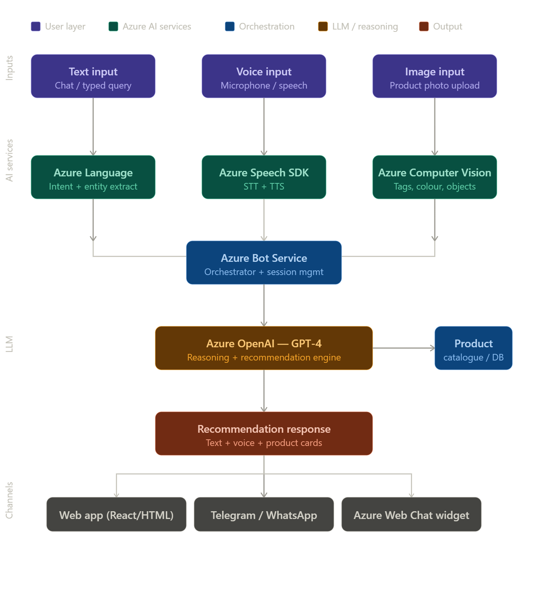

# ShopSenseAI

A Multimodal Personalized Shopping Assistant that uses voice, text, and image inputs to understand user intent, extract preferences, and generate context-aware, real-time product recommendations.

A **high-level system architecture** showing how all Azure components connect:



**User interaction flowchart — the decision-tree flow**


### Project Structure

```
ShopSenseAI/
├── .github/
│   └── workflows/
│       └── deploy.yml
├── static/
│   ├── index.html
|   ├── css/
│   |   └── style.css
|   ├── js/
│   |   └── app.js
├── services/
│   ├── __init__.py
│   ├── openai_service.py
│   ├── speech_service.py
│   ├── vision_service.py
│   └── language_service.py
├── bot/
│   ├── __init__.py
│   └── bot_handler.py
├── app.py
├── config.py
├── requirements.txt
├── .env
├── .gitignore
└── startup.sh
```

Run the Application:

```
py app.py
```